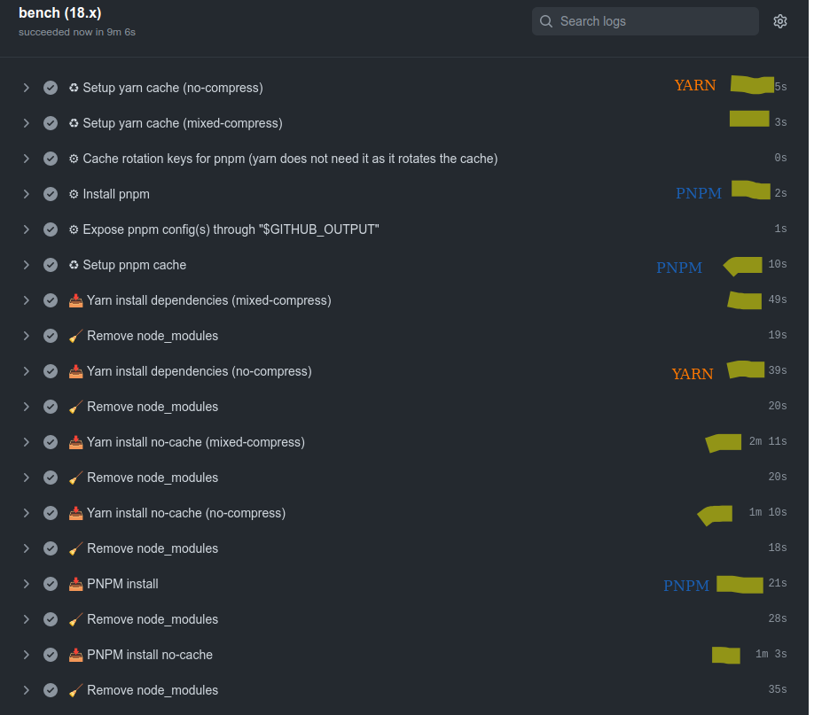

## Compare package managers

Official benchs from [pnpm](https://pnpm.io/benchmarks) and [yarn 3+](https://yarnpkg.com/benchmarks) aren't
conclusive. Let's test them based on [nextjs-monorepo-example](https://github.com/belgattitude/nextjs-monorepo-example)
for fun with CI first approach. 

Potential for co2 emissions reductions at install, build and runtime (♻️🌳❤️) ?

### TLDR;

#### 📥 Install speed 

Yarn 4.0.0-rc.36 / node_modules / supportedArchitecture:current / compressionLevel: 0 seems the fastest with CI cache.

See the action in [.github/workflows/ci-install-benchmark.yml](https://github.com/belgattitude/compare-package-managers/blob/main/.github/workflows/ci-install-benchmark.yml)
and the [history log](https://github.com/belgattitude/compare-package-managers/actions/workflows/ci-install-benchmark.yml). 
That said if you're deploying on vercel, hacks are needed to preserve the cache. 

#### ⏩ Nextjs build speed and lambda size

Build the nextjs-app [standalone mode](https://nextjs.org/docs/advanced-features/output-file-tracing#automatically-copying-traced-files): **Yarn / Pnpm are euqivalent (+/- 1min)**. Curious ? See the action in
[.github/workflows/ci-build-benchmark.yml](https://github.com/belgattitude/compare-package-managers/blob/main/.github/workflows/ci-build-benchmark.yml) and
the [history log](https://github.com/belgattitude/compare-package-managers/actions/workflows/ci-build-benchmark.yml)
That said I couldn't reliably make prisma works with pnpm and standalone mode.

See the section "Debug size" in [.github/workflows/ci-build-benchmark.yml](https://github.com/belgattitude/compare-package-managers/blob/main/.github/workflows/ci-build-benchmark.yml) and
the [history log](https://github.com/belgattitude/compare-package-managers/actions/workflows/ci-build-benchmark.yml)

#### 🔢 Install size (in monorepo)

If you're not using nextjs (with standalone mode) things are different. Yarn does a better job at deduping and
also avoid installing native binaries (ie: glibc, musl) thx to [supportedArchitectures](https://yarnpkg.com/configuration/yarnrc#supportedArchitectures).
See also: https://github.com/pnpm/pnpm/issues/5504.

#### 🦺 Safe to use ?

Seems yarn has matured longer from the [peer-dependency chaos](https://gist.github.com/belgattitude/df235dc0ca3929ef2b56eb26fe6f3bed), 
expect less issues than with PNPM. Small binary commited in the repo, no version conflicts (till corepack becomes a reality).
Also to mention a very [strict policy](https://github.com/yarnpkg/berry/discussions/4965#discussioncomment-3889198) about cheksums.... very difficult to abuse. 


### Technicalities

- [Yarn 4.0.0-rc.36](https://yarnpkg.com/) - "Safe, stable, reproducible projects".
- [Pnpm 7.25.1](https://pnpm.io/) - "Fast, disk space efficient package manager".

Yarn support 3 module resolution algorithms (often called hoisting): node_modules, pnp and pnpm (alpha). Only the
`nodeLinker: node-modules` have been included in this test to prevent any compatibility issues. 
Keep in mind that the pnp linker will be the fastest in install and will even bring speedups at runtime.

Pnpm is a fast moving package manager recently endorsed by vercel that plays well in monorepos. 

### Aspects

- Reproducible ? 
  - Yarn lightweight js binary is committed within the repo (<3mb). That avoid bugs due to
    difference in versions. PNPM is too big to be stored in the repo, you need to install it.
    The experimental [corepack](https://nodejs.org/api/corepack.html)
    will bring solution to this. Both package managers already support corepack, but there's some time before a stable ecosystem shift.
  - Yarn is very picky about strictness, checksums... it's quite difficult to abuse. Something that is generally preferred in the enterprise world. 
- Fast ? 
  - On CI what makes the biggest different is to set up a cache. Simple and easy. 
    See [pnpm cache gist](https://gist.github.com/belgattitude/838b2eba30c324f1f0033a797bab2e31) and [yarn cache gist](https://gist.github.com/belgattitude/042f9caf10d029badbde6cf9d43e400a),
    that gives a 2x boost (and decrease co2 footprint)    
  - Apart from yarn pnp that will be a clear winner, PNPM wins all the time. But be aware that the difference is not that big when you
    handle the cache on the CI.  
    
- Space efficient ? 
  - PNPM helps when many versions of the same library co-exists (ie: lodash...). It only stores
    the files that differs (creates a symlink instead). It might help in those situations (a symlink is 4kb so
    it gives best results if non-changed files are more than 4kb). So useful is some scenarios.
  - PNPM handles peer-deps differently. In some aspects it's more solid than yarn with node_modules
    but it does not dedupe them. 
  - Yarn offers `supportedArchitectures`. When configured to current, it helps to not download native binaries for
    other plaforms (ie: amd64 + musl for esbuild, swc...)

### Scenarios

The following have been tested on CI. Look for the results in the action history:

See results in [actions](https://github.com/belgattitude/compare-package-managers/actions)


### CI: With cache

> Example from a recent run

| CI Scenario             | Install | CI fetch cache | CI persist cache |  Setup | 
|-------------------------|--------:|---------------:|-----------------:|-------:|
| yarn4 mixed-compression |    ±40s |            ±1s |          *(±6s)* |     0s |
| yarn4 no compression    |    ±14s |            ±4s |          *(±9s)* |     0s |
| pnpm7                   |    ±19s |            ±9s |         *(±16s)* |     1s |


The CI fetch cache (time taken for the github action to load and extract the cache archive) 
differences happens can be explained by:

- PNPM dedupe differently that explains the difference in sizes (see below).
- YARN with supportedArchitectures: current does not download extra binaries (ie: linux+musl)
- When yarn use mixed-compression the internal github zstd don't compress the yarn zip archives.   

But in my experience the fetch cache is varying a lot between runs.

Thus: pnpm (19+9+1) = 29s vs yarn no-comp (14+4+0) = 18s.

https://github.com/belgattitude/compare-package-managers/actions/runs/3976413886/jobs/6816885534




Important to mention though

- on yarn.lock changes only yarn is able to start with the cache (download differences only and persist).
- ci persist cache only happens on yarn.lock changes, for example


### CI: Without cache

> Data: https://github.com/belgattitude/compare-package-managers/actions/runs/3346115309/jobs/5542514593

| CI Scenario              | Install | Setup | 
|--------------------------|--------:|------:|
| yarn4 mixed-compression  |    ±98s |    0s |
| yarn4 no compression     |    ±44s |    0s |
| pnpm7                    |   ±102s |    1s | 

Disabling compression in yarn through [compressionLevel: 0](https://yarnpkg.com/configuration/yarnrc#compressionLevel) makes it twice faster. Makes sense as
the js zip compression brings an overhead on single-core cpu's. Pnpm results are very close, but as it does 
not dedupe as *well* (?) it actually downloads more packages (multiple typescript versions...). Difficult
comparison. Confirmed by gdu and action cache:


### CI: action/cache

> First run data: https://github.com/belgattitude/compare-package-managers/actions/runs/3346115309/jobs/5542514593

**Warning** the retrieve/persists times varies a lot between runs.

| CI Scenario              | Retrieve cache | Persist cache |  Size | 
|--------------------------|---------------:|--------------:|------:|
| yarn4 mixed-compression  |            ±5s |           ±6s | 230MB |
| yarn4 no compression     |            ±8s |           ±9s | 190MB |
| pnpm7                    |           ±14s |          ±16s | 273MB |

When already compressed the yarn cache is stored faster in the github cache. Make sense as action/cache won't 
try to compress something already compressed. On the pnpm side saving the pnpm-store is much slower, this is due
to different deduplication but also to the fact that it has to compress more files (+symlinks...). Note also
that regarding cache yarn has an advantage: it does not need to be recreated for different os/architectures. 

<details>
  <summary>Give me a screenshot of cache retrieval</summary>
   
</details>

<details>
  <summary>Give me a screenshot of cache restoration</summary>
   
</details>


## Want to test locally ?

Use [hyperfine](https://github.com/sharkdp/hyperfine) and [taskset](https://man7.org/linux/man-pages/man1/taskset.1.html) 
to mimic single-core speed.

| Command | Mean [s] | Min [s] | Max [s] | Relative |
|:---|---:|---:|---:|---:|
| `taskset -c 0 npm run install:yarn-mixed-comp:cache` | 48.852 ± 1.146 | 47.977 | 50.347 | 1.56 ± 1.24 |
| `taskset -c 0 npm run install:yarn-no-comp:cache` | 38.916 ± 0.170 | 38.707 | 39.075 | 1.24 ± 0.99 |
| `taskset -c 0 npm run install:pnpm:cache` | 31.368 ± 24.988 | 20.147 | 76.067 | 1.00 |

```bash
hyperfine --runs=5 --export-markdown "docs/bench-yarn-vs-pnpm-single-core.md" \
--prepare "npm run install:yarn-mixed-comp; npx --yes rimraf '**/node_modules'" \
"taskset -c 0 npm run install:yarn-mixed-comp:cache" \
--prepare "npm run install:yarn-no-comp; npx --yes rimraf '**/node_modules'" \
"taskset -c 0 npm run install:yarn-no-comp:cache" \
--prepare "pnpm i; npx --yes rimraf '**/node_modules'" \
"taskset -c 0 npm run install:pnpm:cache" 
```

## Changelog

## Sponsors :heart:

If you are enjoying some this guide in your company, I'd really appreciate a [sponsorship](https://github.com/sponsors/belgattitude), a [coffee](https://ko-fi.com/belgattitude) or a dropped star.
That gives me some more time to improve it to the next level.

